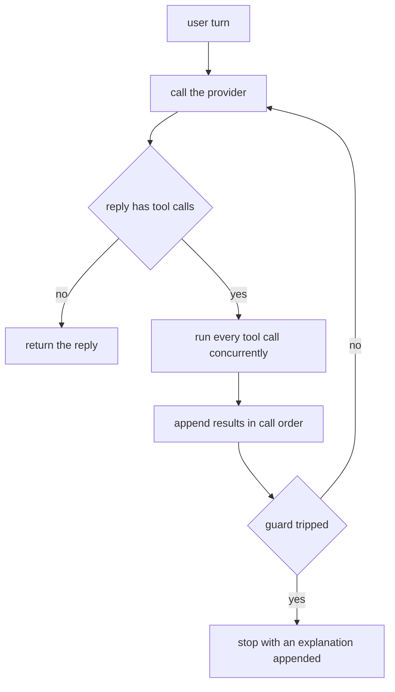

# pico code

A small CLI AI agent written in Go. One agent loop, two LLM backends —
[Anthropic](https://docs.anthropic.com/) (cloud) and [Ollama](https://ollama.com/)
(local) — and a handful of sandboxed tools (read a file, list a directory, run
an allowlisted command, write a file behind a flag).

## Quickstart

Requires Go 1.26+.

```bash
git clone https://github.com/reno/pico-code.git
cd pico-code
make build          # -> bin/pico
```

Pick a backend and talk to it:

```bash
# Local, no account needed — see "Ollama" below for the one-time setup.
./bin/pico --provider=ollama --model=qwen3:8b

# Cloud — needs ANTHROPIC_API_KEY set first.
./bin/pico --provider=anthropic --model=claude-sonnet-4-5
```

Either command drops you into a `> ` prompt. Ctrl+D (EOF) exits cleanly;
Ctrl+C interrupts the process the way it would any CLI tool — one to stop,
a second if the first doesn't. `--tui` behaves differently on purpose: see
[While chatting](#while-chatting).

## The two backends

### Anthropic

```bash
export ANTHROPIC_API_KEY=sk-ant-...
./bin/pico --provider=anthropic --model=<a Claude model ID>
```

Nothing else to install. Retries on 429/5xx happen inside the SDK; a bad key
or an unreachable network surfaces as a clear error rather than a hang.

#### Prompt caching

Every request marks two `cache_control` breakpoints: one on the system
prompt, one on the last block of the last message. Because history only
ever grows by appending, each new turn's request shares an identical
prefix with the one before it up to that second breakpoint — the provider
serves everything up to there from cache and only charges full price for
the newly appended tail. A `/compact` (or automatic compaction, 8.2)
rewrites the oldest turns into a fresh synthetic summary, which changes
the cached prefix's bytes; the next request simply writes a new cache
entry there instead of ever risking a stale one.

The savings are real but numbers vary a lot by conversation shape, so
here's the arithmetic rather than a single "X% faster" claim, using
`claude-sonnet-4-5`'s published per-token rates ($3.00 input / $3.75 cache
write / $0.30 cache read, per million tokens — see `internal/config/pricing.go`
for the same "these are estimates" caveat `/usage` carries). For a 2,000
token stable prefix (a typical system prompt plus tool definitions) reused
across 10 requests within the cache's TTL:

| | cost |
|---|---|
| without caching (10 × full-price reads of the 2,000 tokens) | 10 × 2000 × $3.00 / 1e6 = **$0.0600** |
| with caching (1 write + 9 reads of the 2,000 tokens) | (2000 × $3.75 / 1e6) + 9 × (2000 × $0.30 / 1e6) = $0.0075 + $0.0054 = **$0.0129** |

That's a ~78% reduction on the *stable-prefix portion* of input cost over
10 turns, and it keeps improving the longer the conversation runs — the
one-time write premium amortizes away while every later turn keeps paying
the ~10×-cheaper read rate. It only covers the part of each request that's
actually stable; the growing tail (each turn's own new messages) is never
cached and always costs full price, so a whole conversation's total
savings will be smaller than this in practice.

### Ollama

```bash
# once: install Ollama (https://ollama.com/download), make sure it's
# running (the desktop app does this for you; on Linux, `ollama serve`),
# and pull a model
ollama pull qwen3:8b

./bin/pico --provider=ollama --model=qwen3:8b
```

`OLLAMA_HOST` overrides the default `http://localhost:11434`. Ollama
silently truncates context if its `num_ctx` option is left unset — pico
code always sets it explicitly (`--num-ctx`, default 4096) and logs the
effective value at startup.

Not every local model supports native tool calling, and some that advertise
support still narrate a tool call in prose instead of using it. So
`--provider=ollama` defaults `--tools` to `prompted` unless you pass
`--tools` explicitly; pass `--tools=native` yourself if your model handles
it reliably. (`--provider=anthropic` keeps defaulting to `native`.)
`--tools=prompted` injects tool schemas into the system prompt and parses a
fenced JSON block back out of the reply instead of relying on the model's
native tool-calling — it can't stream, so it also forces `--stream=false`
for that turn (a log line says so), and it isn't available at all under
`--tui`, which always streams; combine `--tui` with `--provider=ollama` and
you'll need to add `--tools=native` explicitly.

## Flags

| Flag              | Default      | Meaning                                                      |
| ----------------- | ------------ | -------------------------------------------------------------- |
| `--provider`      | `anthropic`  | `anthropic` or `ollama`                                       |
| `--model`         | (none)       | model ID for the selected provider                            |
| `--max-turns`     | `25`         | agent loop turns before it stops on its own                   |
| `--token-budget`  | `100000`     | cumulative tokens before it stops on its own                   |
| `--workspace`     | `.`          | root directory filesystem tools are confined to                |
| `--yes`           | `false`      | skip interactive approval prompts                              |
| `--tools`         | `native` (`prompted` for `--provider=ollama`) | `native` or `prompted`; prompted mode ignores `--tui` and forces non-streaming |
| `--stream`        | `true`       | stream a reply as it arrives, plain mode only (the TUI always streams) |
| `--tui`           | `false`      | bubbletea TUI instead of the plain read-eval-print loop         |
| `--log-level`     | `info`       | `debug`, `info`, `warn`, or `error`                            |
| `--num-ctx`       | `4096`       | Ollama's context window (`num_ctx`); ignored by Anthropic       |
| `--allow-write`   | `false`      | register the `write_file` tool                                 |
| `--session`       | (none)       | name a session to resume or start; saved after every turn       |
| `--allow-commands`| (none)       | comma-separated binary allowlist; registers `run_command` only if non-empty |
| `--context-window`| `200000`     | context window compaction measures usage against; ignored by Ollama, which uses `--num-ctx` |
| `--think`         | `false`      | ask the model for a reasoning trace ahead of its reply; currently Ollama only |

`PICO_CODE_PROVIDER` is an environment fallback for `--provider`, checked
only when the flag isn't explicitly set. `ANTHROPIC_API_KEY` and
`OLLAMA_HOST` are read from the environment only — there's no flag for
either, so a credential never ends up in shell history.

## While chatting

Both the plain REPL and the TUI understand the same commands:

- `/usage` — cumulative and last-turn token counts, plus an estimated USD
  cost when the active model has a pricing entry (see below); Ollama always
  shows $0, since it runs locally
- `/new` — start a fresh, unsaved conversation
- `/save [name]` — save the current conversation as a session
- `/load <name>` — replace the current conversation with a saved session

`--session <name>` does the same save/resume automatically, after every
turn, in both — kill the process mid-conversation and `--session <name>`
again picks up where it left off.

### Cost estimates

`/usage`'s cost figures come from a small per-model pricing table checked
into `internal/config/pricing.go` — snapshotted from published rates at
some point in time, not fetched live. Prices change; treat the number as a
budgeting estimate, never as a billing-accurate figure. A model with no
entry in the table (a typo, a brand-new release, most non-Anthropic
models) shows no cost line at all rather than a misleading `$0.00`.
Ollama is the one exception: since it always runs locally, `/usage` always
reports it as an explicit `$0.0000` instead of omitting the line.

`--tui` swaps the REPL for a full-screen interface (scrollback, a spinner
while the model thinks, tool calls shown with a running/✓/✗ status,
markdown rendering for finished replies, an approval modal for tools that
need sign-off). A command's output appears in the scrollback prefixed with
the command line itself, since the TUI otherwise never echoes what you
typed. Its Ctrl+C/Ctrl+D also differ from the plain REPL's on purpose:
Ctrl+C there cancels only the in-flight turn and returns to the prompt,
and Ctrl+D is the one that exits — a per-turn cancellation the plain REPL
doesn't have, since its context is shared process-wide rather than derived
fresh per turn.

With `--think` on (16.1), a model's reasoning trace shows as a dim,
collapsed-by-default block above its reply — `ctrl+t` expands or collapses
it. Like tool-call blocks, it's visible only while a turn is in flight and
isn't kept once the reply finalizes; the plain REPL never shows it at all,
even with `--think` on, since piped/redirected output stays ANSI-free by
design.

## Safety

- Filesystem tools are confined to `--workspace`, resolved through
  `EvalSymlinks` so a symlink can't point a read or write outside it. Reads
  of `.env`, `.git/config`, `*.pem`, and `id_*` are denied outright.
- `run_command` (registered only when `--allow-commands` names at least one
  binary) executes only that allowlisted binary, directly (`exec.Command`,
  never a shell — no `|`, `&&`, `$()`, or similar can do anything), with a
  timeout and truncated output.
- `write_file` and `run_command` both need approval unless `--yes` is
  passed; the plain REPL prompts on the terminal, the TUI shows a modal.
- Tool output is truncated (head + tail, with an elision marker) before it
  ever reaches the model's context, so one large file can't blow the
  context window.

## How the agent loop works



A guard trips on max turns, the token budget, a wall-clock timeout, or the
same tool call repeating three times in a row.

Every tool call the model issues is answered by exactly one tool result, in
the same message, in the same order — even if the tool panics, times out,
or the run is cancelled mid-call. That invariant is asserted in the history
package itself (`history.Validate`), not just hoped for, and it's what makes
compaction and session persistence safe to build on top of: a saved or
compacted history is always in a state the model can resume from cleanly.

## Development

```bash
make build   # bin/pico
make test    # go test ./... — offline, no network, no API keys
make lint    # gofmt -l . && go vet ./... && golangci-lint run
make run     # go run ./cmd/pico --provider=ollama
```

`make test` never touches the network. Provider adapters replay recorded
HTTP exchanges from `testdata/golden/` through an `httptest.Server`; running
a test with `RECORD=1` (and real credentials, for the adapters that need
them) re-records against the live API instead, scrubbing any credential
before the fixture is written back to disk.

## What I learned / what breaks with small models

Small local models are the reason most of the guard rails in this codebase
exist:

- **They invent tool names.** The registry rejects an unknown name with an
  error result — handed back to the model as data, not a crash — and the
  model usually corrects itself on the next turn.
- **They repeat themselves.** A model stuck in a loop calling the same tool
  with the same arguments gets cut off after three identical calls in a
  row, with an explanation appended to the transcript instead of spinning
  forever.
- **They emit arguments that don't match the schema**, or send them as a
  JSON-encoded *string* instead of an object (Ollama does this often enough
  that the adapter normalizes both shapes before decoding). Validation
  failures go back to the model as an error result with the actual message,
  which is usually enough for a capable-but-small model to fix on retry.
- **Some don't call tools at all — they narrate the call in prose.** That's
  what `--tools=prompted` is for: schemas injected into the system prompt,
  a fenced JSON block parsed back out of the reply instead of relying on
  native tool-calling.
- **Streaming exposed a real gap in `encoding/json`.** A JSON string chunk
  containing a truncated multi-byte UTF-8 sequence gets silently replaced
  with U+FFFD by Go's own decoder — which mattered for testing "a tool
  argument split mid-character" honestly: splitting raw UTF-8 bytes across
  SSE chunks is untestable for this exact reason, so the fixture instead
  splits a `\uXXXX` escape sequence, which is always well-formed at the
  outer JSON-encoding level regardless of where it's cut.

More generally: almost everything CLAUDE.md calls a "provider gotcha" was
discovered by actually running a small model against this loop, not
anticipated up front. The cloud model mostly behaves; the local one is what
taught this codebase to be defensive.
